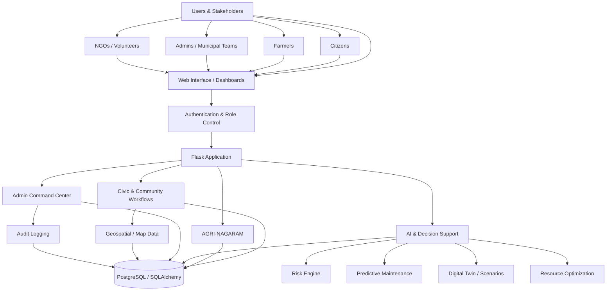
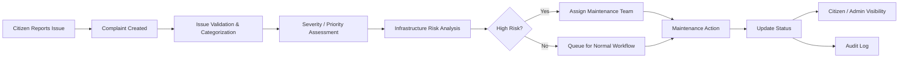
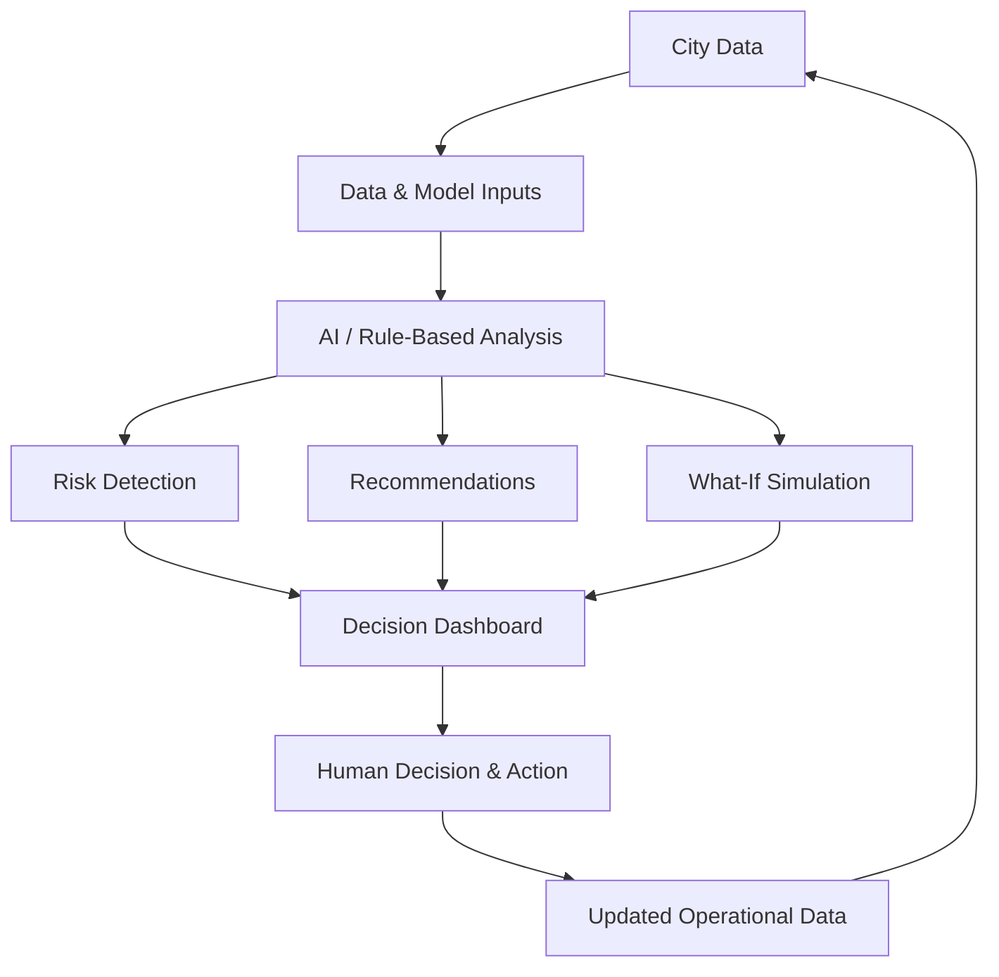
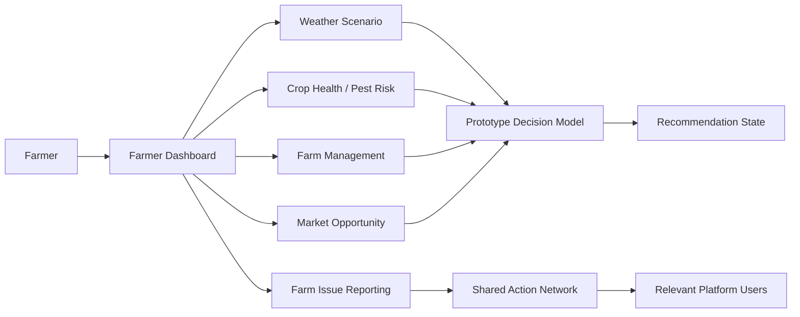
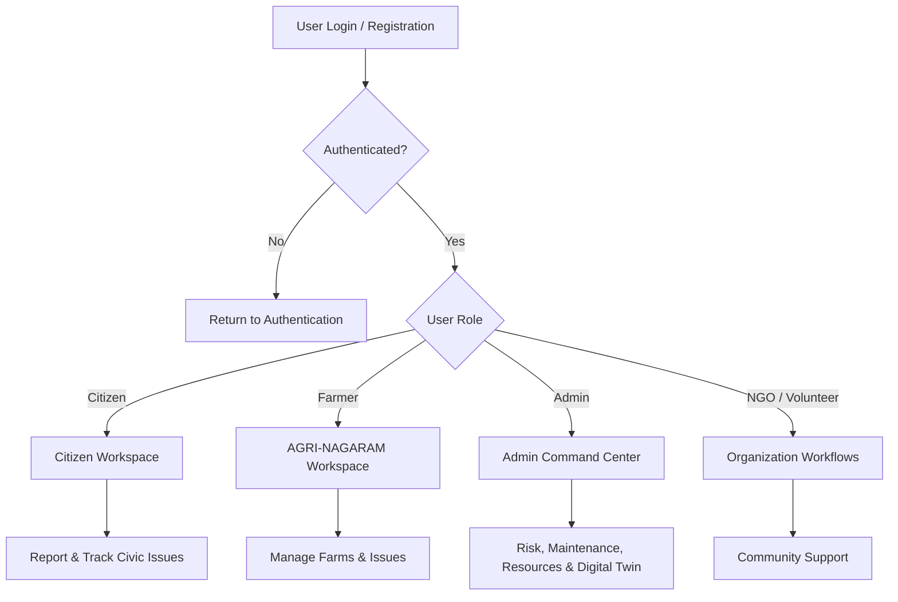

# NAGARAM 🏙️

**NAGARAM** is a smart civic and urban management platform designed to connect citizens, municipal teams, NGOs, volunteers, and farmers through a shared digital workspace.

## 🌟 What it does

NAGARAM brings together civic issue reporting, infrastructure monitoring, risk analysis, maintenance planning, sustainability tracking, and decision-support tools in one Flask-based application.

### 🏛️ Civic & Urban Management
- Citizen complaint and issue tracking
- Infrastructure asset monitoring
- Risk assessment and prioritization
- Predictive maintenance workflows
- Maintenance team and resource management
- City health and infrastructure risk dashboards
- Geospatial data for complaints, assets, and emergency services
- Sustainability indicators and SDG-oriented monitoring
- Admin audit logs and decision-support tools

### 🧠 AI & Decision Support
NAGARAM includes prototype AI-assisted features for:
- Identifying urgent infrastructure risks
- Recommending maintenance crew deployment
- Providing city-health insights
- Exploring traffic and road-closure scenarios
- Supporting what-if analysis through a digital-twin interface

### 🌾 AGRI-NAGARAM
The platform also includes an agricultural workspace for farmers, sharing the same authentication and action network. It supports:
- Farm management
- Farm issue reporting
- Weather and crop-health scenario inputs
- Market opportunity information
- Prototype recommendations and decision scenarios

> Agricultural decision outputs and market values in the prototype are explicitly treated as demo/estimated data and are not scientific agronomic predictions.

## 🏗️ System Architecture



### Architecture layers

| Layer | Responsibility |
|---|---|
| **Presentation** | Role-based web pages, dashboards, maps and management interfaces |
| **Authentication** | Login, sessions and role-based access control |
| **Application** | Flask routes, civic workflows, farmer workflows and admin operations |
| **Intelligence** | Risk analysis, predictive maintenance, recommendations and scenario simulation |
| **Data** | SQLAlchemy models with PostgreSQL support |
| **Integration** | Shared identity and action network between civic and agricultural workspaces |

## 🔄 Core Civic Issue Flow



## 🧠 AI Decision-Support Flow



> **Note:** AI outputs in the current project are prototype decision-support features. They should be reviewed by responsible human operators before real-world action.

## 🌾 AGRI-NAGARAM Flow



## 🔐 Role & Access Flow



## 🛠️ Technology

- **Backend:** Python, Flask
- **Database:** SQLAlchemy with PostgreSQL support
- **Authentication:** Flask-Login
- **Forms & security:** Flask-WTF, Werkzeug
- **Configuration:** python-dotenv
- **Frontend:** HTML templates and web-based dashboards

## 📁 Main capabilities

```text
NAGARAM
├── Civic reporting & community workflows
├── Admin command center
├── Infrastructure risk engine
├── Predictive maintenance
├── Resource optimization
├── Digital Twin / scenario simulation
├── Sustainability dashboard
├── Data hub & audit logging
└── AGRI-NAGARAM farmer workspace
```

## 🚀 Getting Started

### 1. Clone the repository

```bash
git clone https://github.com/arjune08/NAGARAM.git
cd NAGARAM
```

### 2. Create a virtual environment

```bash
python -m venv .venv
```

Activate it according to your operating system.

### 3. Install dependencies

```bash
pip install -r requirements.txt
```

### 4. Configure environment variables

Copy `.env.example` to `.env` and configure the database and application settings required by the project.

### 5. Run the application

Start the Flask application using the repository's existing application entry point.

## 🔐 User roles

NAGARAM is structured around multiple platform roles, including citizens, farmers, administrators, NGOs, and volunteers, with role-specific workflows and dashboards.

## 🎯 Vision

NAGARAM aims to make cities more **responsive, resilient, sustainable, and data-driven** by turning community reports and infrastructure data into actionable information for the teams responsible for improving everyday urban life.

## 📌 Project status

NAGARAM is an evolving prototype focused on demonstrating an integrated smart-city platform and its potential extension into agriculture and community services.

---

**Built with Python, Flask, SQLAlchemy, and a vision for smarter communities.**
